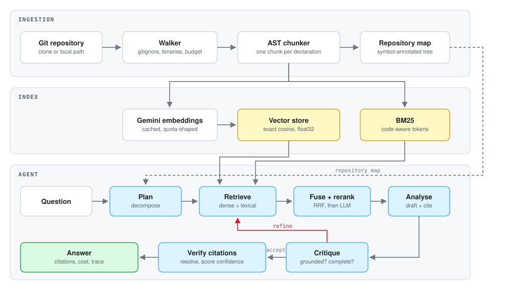

<div align="center">

# RepoSage

**Agentic code intelligence for any Git repository.**

Index a codebase with AST-aware chunking, retrieve over it with hybrid search,
and answer architectural questions with verified line-level citations.
Then let it review your pull requests.

### [▶ Try the live demo](https://huggingface.co/spaces/adwitiyashukla/reposage)

<sub>Running against its own source code, pre-indexed. No signup, no setup.</sub>

[](https://huggingface.co/spaces/adwitiyashukla/reposage)
[](https://github.com/adwitiyashukla/reposage-ai/actions/workflows/ci.yml)
[](evals/REPORT.md)
[](https://www.python.org/downloads/)
[](LICENSE)
[](https://github.com/astral-sh/ruff)

</div>

---

## The problem

Dropping a new engineer into an unfamiliar codebase is expensive. So is asking a
language model about one: paste a few files into a chat window and you get a
fluent answer that cites functions which do not exist.

The failure is almost never the model. It is the retrieval. Most code RAG
systems split files into fixed-size text windows, embed them, and take the top
five by cosine similarity. That breaks in three specific ways:

1. **A function cut in half retrieves badly.** The chunk that matches your query
   often does not contain the logic that answers it.
2. **Embeddings cannot do exact lookup.** `ProcessPaymentIntent` and
   `handle_payment` sit close together in vector space, which is useful for
   concept search and actively wrong when you typed a specific symbol.
3. **One retrieval pass is a guess.** If the first search misses, nothing in the
   system notices, and the model confabulates over whatever it got.

RepoSage addresses each one directly, and measures whether the fix worked.

---

## What it does

```bash
pip install -e ".[treesitter]"
reposage index tiangolo/fastapi
reposage ask -r fastapi "How does dependency injection resolve nested dependencies?"
```

```
Dependency resolution is driven by `solve_dependencies`
[fastapi/dependencies/utils.py:520-612], which walks the `Dependant` tree
depth-first and caches each sub-dependency by (call, security_scopes) so a
dependency requested twice in one request is executed once
[fastapi/dependencies/utils.py:556-571].

...

confidence 86%   4.2s | 41,802 tokens | $0.0041 | 1 refinement
```

Every bracketed reference is a real file and line range, verified against the
index before it is shown. Click one in the web UI and the exact lines open.

---

## Architecture

<p align="center">
  <picture>
    <source media="(prefers-color-scheme: dark)" srcset="docs/assets/architecture-dark.svg">
    <source media="(prefers-color-scheme: light)" srcset="docs/assets/architecture-light.svg">
    
  </picture>
</p>

### The three fixes

**AST-aware chunking.** Files are parsed with tree-sitter and emitted as one
chunk per declaration, so a retrieved chunk is a complete function, class or
method with a name and an exact line range. Classes larger than the line budget
are split per method *and* summarised as a skeleton chunk listing their members,
because "what does this class do?" needs the outline, not one method. Every
chunk carries a deterministic header naming its file and imports, which recovers
most of the benefit of LLM-generated contextual retrieval at zero token cost.
Languages without a grammar fall back to structure-aware line chunking that
snaps to blank lines and dedents, so the pipeline never hard-fails.

**Hybrid retrieval.** Dense embedding search and BM25 run over every query
variant the planner produced. The lexical tokenizer splits compound identifiers,
so `getUserByID` indexes as the whole token and as `get`, `user`, `by`, `id`, and
a query for either form matches. The two ranked lists are merged with reciprocal
rank fusion, which uses only ordinal position and therefore needs no per-corpus
score calibration. The fused shortlist is diversified so no single file can
monopolise the context window, then reranked by an LLM that reads the query and
candidate together.

**A self-correcting loop.** A critic reads the draft answer against a compact
index of what was retrieved and judges grounding and completeness. When it finds
a real gap it emits concrete follow-up queries and the graph loops back to
retrieval, merging new context with what already worked. The refinement budget is
bounded, so a run always terminates. Finally, every citation is resolved against
the index: markers that do not resolve are dropped and counted against the
confidence score.

---

## Live demo

**[huggingface.co/spaces/adwitiyashukla/reposage](https://huggingface.co/spaces/adwitiyashukla/reposage)**

The demo answers questions about RepoSage's own codebase, shipped pre-indexed so
it responds immediately rather than making you wait several minutes for an index
build. The right-hand panel streams the agent's actual reasoning: planning,
retrieval, reranking, drafting, self-critique, then citation verification.

Try asking:

- *How does the critic decide whether to refine an answer?*
- *Why is reciprocal rank fusion used instead of normalising and adding scores?*
- *How are source files split into chunks, and why not fixed-size splitting?*

Click any citation to read the exact lines the answer was built from.

Indexing is disabled on the demo and the shared API key is metered per visitor
and per day, because a public URL on a free-tier key is otherwise one crawler
away from being permanently broken. When the daily budget is spent the demo does
not break: it offers a box to paste your own free key, and those requests bypass
the budget because they cost the host nothing. See
[`api/demo.py`](src/reposage/api/demo.py).

## Quickstart

**Requirements:** Python 3.10+, Git, and a free
[Gemini API key](https://aistudio.google.com/apikey).

```bash
git clone https://github.com/adwitiyashukla/reposage-ai.git
cd reposage

python -m venv .venv && source .venv/bin/activate     # Windows: .venv\Scripts\activate
pip install -e ".[dev,treesitter]"

cp .env.example .env                                  # then add your GEMINI_API_KEY
reposage doctor                                       # verifies config and connectivity
```

Index something and ask it a question:

```bash
reposage index .                       # index RepoSage itself
reposage list                          # shows the index id that was created
reposage ask -r reposage-ai "How does the critic decide to refine an answer?"
```

The index id is derived from the directory or repository name and is printed
when indexing finishes, so use whatever `reposage index` reported.

Or use the web UI:

```bash
reposage serve                         # http://127.0.0.1:8000
```

<div align="center">
<em>The UI streams the agent's reasoning live: planning, retrieval, reranking,
drafting, self-critique, then citation verification, with token cost per run.</em>
</div>

### Docker

```bash
echo "GEMINI_API_KEY=your-key" > .env
docker compose up --build              # http://localhost:8000
```

---

## Pull request review

RepoSage reviews diffs against the *indexed repository*, not in isolation. Before
reviewing each file it retrieves the code around the identifiers the diff
touches, which is what stops it flagging a missing null check that a caller three
files away already guarantees.

```bash
reposage review --diff my-change.diff --repo reposage
git diff main | reposage review --diff - --repo reposage
reposage review --pr owner/repo#42 --repo reposage --post --fail-on high
```

As a GitHub Action:

```yaml
name: AI review
on: pull_request
permissions:
  contents: read
  pull-requests: write

jobs:
  review:
    runs-on: ubuntu-latest
    steps:
      - uses: actions/checkout@v4
      - uses: adwitiyashukla/reposage-ai/.github/actions/reposage-review@main
        with:
          gemini-api-key: ${{ secrets.GEMINI_API_KEY }}
          github-token: ${{ secrets.GITHUB_TOKEN }}
          fail-on: high
```

Findings below a confidence threshold are dropped, anchors are snapped to lines
that actually changed or removed entirely, duplicates are collapsed, and the
summary comment is edited in place on re-runs rather than appended. If GitHub
rejects an inline comment the review degrades to a summary rather than failing.

---

## Evaluation

Most portfolio RAG projects assert that they work. This one measures it.

```bash
reposage index .
python -m evals.run_evals --repo reposage-ai --output evals/REPORT.md
```

Three things are measured independently:

| Layer | Metrics | Cost |
| --- | --- | --- |
| **Retrieval** | recall@k, precision@k, MRR, nDCG, hit rate | Free, deterministic |
| **Answers** | LLM judge on correctness / groundedness / completeness, citation validity, required-fact coverage | Model calls |
| **Operations** | latency, tokens, dollars per answer | Free |

The harness also runs an **ablation** over the production retrieval path, so
improvements are attributed rather than claimed. Measured on this repository:

| Configuration | recall@k | MRR | nDCG |
| --- | --- | --- | --- |
| dense only | 80.6% | 0.611 | 0.575 |
| lexical only | 69.4% | 0.557 | 0.509 |
| hybrid + RRF | 80.6% | 0.778 | 0.679 |
| **hybrid + rerank** | **88.9%** | **0.833** | **0.797** |

The interesting result is that fusion barely moves recall but lifts MRR by 27%:
both retrievers were already finding the right files, and RRF was mainly fixing
*where in the list* they landed. Reranking is what converts that into recall,
because it promotes the chunk that answers the question over the chunk that
merely mentions it. Ranking quality, not raw recall, was the bottleneck.

<sub>Full report, including per-case scores and every failure, in
[`evals/REPORT.md`](evals/REPORT.md). Regenerate it with
`python -m evals.run_evals --repo <index-id>`.</sub>

The golden dataset ships in `evals/datasets/golden.jsonl` and targets RepoSage
itself, so anyone who clones the repository can reproduce a run. A test asserts
every path in the dataset still exists, which stops ground truth silently rotting
as the code moves.

In CI, `--min-recall` and `--min-pass-rate` turn the suite into a quality gate: a
pull request that degrades retrieval fails before it merges.

> **Free-tier note.** Indexing this repository costs roughly 500 embedding
> requests, and Gemini's free tier caps embeddings per day as well as per
> minute. Two or three full index builds will exhaust a day's allowance, after
> which indexing fails with an explicit quota error rather than a partial index.
> The embedding cache makes a retry resume almost instantly, and CI restores
> that cache between runs, but a fresh index on an exhausted key has to wait for
> the daily reset. The scheduled weekly evaluation is sized to stay inside it.

---

## HTTP API

`reposage serve` exposes an OpenAPI-documented API at `/docs`.

| Method | Path | Purpose |
| --- | --- | --- |
| `GET` | `/api/health` | Version, configuration, index count |
| `GET` | `/api/ready` | Readiness including a live model probe |
| `POST` | `/api/indexes` | Build an index |
| `GET` | `/api/indexes/stream/build` | Build with SSE progress |
| `GET` | `/api/indexes` | List indexes |
| `POST` | `/api/ask` | Ask a question |
| `GET` | `/api/ask/stream` | Ask with a live SSE agent trace |
| `GET` | `/api/source/{repo}` | Read an indexed file for citation display |
| `POST` | `/api/review` | Review a unified diff |
| `GET` | `/api/graph` | The agent graph as Mermaid |

---

## Configuration

Everything is driven by environment variables or `.env`. See
[`.env.example`](.env.example) for the annotated list.

| Variable | Default | Effect |
| --- | --- | --- |
| `GEMINI_API_KEY` | *required* | Model access |
| `REPOSAGE_FAST_MODEL` | `gemini-flash-lite-latest` | Planning, reranking, critique |
| `REPOSAGE_DEEP_MODEL` | `gemini-flash-latest` | Analysis and review |
| `REPOSAGE_TOP_K` | `12` | Chunks passed to the analyst |
| `REPOSAGE_CANDIDATE_K` | `40` | Candidates from each retriever |
| `REPOSAGE_ENABLE_RERANK` | `true` | LLM listwise reranking |
| `REPOSAGE_ENABLE_CRITIC` | `true` | Self-critique loop |
| `REPOSAGE_MAX_REFINEMENTS` | `2` | Retrieval retry budget |
| `REPOSAGE_CHUNK_MAX_LINES` | `120` | Chunk line budget |
| `REPOSAGE_MAX_RPM` | `0` | Client-side rate cap (0 disables) |
| `REPOSAGE_ENABLE_CACHE` | `true` | Disk cache for generations and embeddings |

---

## Design decisions

Choices worth defending, and what they cost.

**REST over the vendor SDK.** The Gemini provider talks to the HTTP API through
`httpx` rather than `google-genai`. That buys one dependency instead of a
transitive tree, full control over timeouts, retry classification and SSE
parsing, and immunity to SDK major-version churn. It costs about 150 lines of
request shaping, covered by unit tests with a mocked transport. Everything sits
behind an `LLMProvider` protocol, so Groq, OpenRouter or a local Ollama server is
a new class, not a refactor.

**Exact vector search.** Dense retrieval is a brute-force cosine matmul over one
contiguous float32 matrix. At repository scale (tens of thousands of chunks) that
is a few milliseconds, recall is perfect so a retrieval regression can never be
blamed on an approximate index, and it adds no dependency and no service to run.
Past a few hundred thousand chunks an ANN index wins, which is why the code is
written against a `VectorStore` protocol.

**BM25 implemented in-tree.** An inverted index with NumPy postings scores a
query in one vectorised pass per term and serialises to two small files. It also
means the tokenizer can be code-aware, which is the entire reason lexical search
pulls its weight here.

**An LLM reranker instead of a cross-encoder.** A hosted cross-encoder needs a
GPU and a model download. Listwise LLM scoring runs on a free tier, keeps the
install dependency-free, and degrades to the fused ordering if a window fails.

**Tracing without OpenTelemetry.** The system needs in-process, single-run
visibility, not a collector. The event schema is deliberately OTel-shaped, so
exporting later is a small change rather than a rewrite.

**Grammars from wheels, not downloads.** Each `tree-sitter-<lang>` wheel ships a
compiled grammar, so container builds are reproducible and CI works offline.

---

## Project layout

```
src/reposage/
├── config.py              Environment-driven settings, validated once
├── models.py              Domain types shared by every layer
├── cli.py                 Typer CLI mirroring the HTTP API
├── ingest/
│   ├── walker.py          gitignore-aware traversal, importance ranking
│   ├── chunker.py         tree-sitter chunking, container splitting, fallbacks
│   ├── languages.py       Per-language node types and parsing metadata
│   ├── repository.py      Shallow clone / local path resolution
│   └── pipeline.py        Ingestion orchestration and the repository map
├── index/
│   ├── vector_store.py    VectorStore protocol + exact NumPy implementation
│   ├── lexical.py         Code-aware tokenizer + BM25 inverted index
│   ├── fusion.py          Reciprocal rank fusion
│   ├── reranker.py        Listwise LLM reranking
│   ├── retriever.py       The hybrid pipeline, with ablation modes
│   └── store.py           Index build, persistence and lifecycle
├── agents/
│   ├── prompts.py         Every prompt, versioned in one place
│   ├── graph.py           The LangGraph state machine
│   ├── engine.py          CodebaseAgent: ask() and astream()
│   └── nodes/             plan, retrieve, analyse, critique, finalise
├── review/
│   ├── diff.py            Unified diff parser with exact line mapping
│   ├── reviewer.py        Context-grounded review agent
│   └── github.py          Idempotent review posting
├── llm/                   Provider, cache, pricing, rate limiting
├── observability/         Spans, token accounting, live event streaming
├── api/                   FastAPI app, routes, schemas
└── web/                   Single-file UI, no build step

evals/                     Dataset, metrics, judges, ablation harness, report
tests/                     Offline suite: no API key, no network
```

---

## Development

```bash
make install     # venv + all extras
make check       # lint, type check, tests
make test-cov    # coverage report
make run         # dev server with reload
make eval        # evaluation suite
```

The test suite is fully offline. A deterministic fake provider stands in for the
model, so tests are fast, free and reproducible, and CI needs no secrets.

---

## Limitations

Worth stating plainly.

- Answer quality depends on retrieval. Questions whose answer is spread across
  many files thinly ("where is every place we retry?") are harder than questions
  with a clear locus.
- The critic is a language model judging a language model. It catches obvious
  ungrounded claims reliably and subtle ones inconsistently, which is why
  confidence is tempered by verifiable citation signals rather than trusting it.
- Indexing is a full rebuild. Incremental re-indexing on a commit range is the
  obvious next step; the embedding cache already makes rebuilds cheap.
- Repository history is not indexed, so "why was this changed?" is out of scope.

---

## Roadmap

- Incremental indexing driven by `git diff` between commits
- Call-graph edges as a retrieval signal alongside text similarity
- A pluggable ANN backend behind the existing `VectorStore` protocol
- Multi-repository queries for questions that span services

---

## License

MIT. See [LICENSE](LICENSE).

<div align="center">
<sub>Built by <a href="https://github.com/adwitiyashukla">Adwitiya Shukla</a></sub>
</div>
